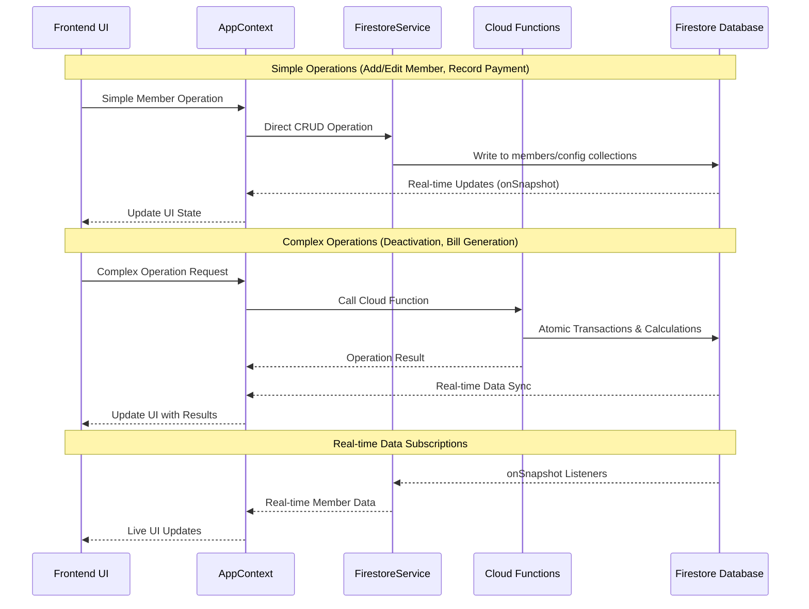

# Member Management - Design Document

## Overview

The Member Management feature provides comprehensive functionality for managing tenant lifecycles in a multi-floor rent management application. Built on Firebase Firestore with React 19 and Mantine UI, it provides real-time data synchronization, financial tracking, and seamless integration with rent management, configuration, and authentication systems.

### Key Design Principles

- **Real-time Synchronization**: All member data updates reflect immediately across interfaces
- **Financial Accuracy**: Precise calculations with atomic transactions
- **Data Integrity**: Comprehensive validation and business rule enforcement
- **Security**: Role-based access control with proper authentication
- **Performance**: Efficient data loading with optimized queries

## Architecture

### System Architecture Overview

```mermaid
graph TB
    subgraph "Frontend Layer"
        A[Admin Dashboard] --> B[Rent Management Section]
        A --> C[Member Management Section]
        A --> D[Configuration Section]

        B --> E[Generate Bills Modal]
        B --> F[Record Payment Modal]
        B --> G[Add Expense Modal]

        C --> H[Add/Edit Member Modal]
        C --> I[Delete Member Modal]
        C --> J[Deactivate Member Modal]
        C --> K[Member Search & Filter]
        C --> L[Member Statistics Display]
        C --> M[Member Accordion List]

        D --> N[Floor Rate Settings]
        D --> O[General Settings]
        D --> P[Admin Management Panel]

        Q[Member Dashboard] --> R[Me Tab]
        Q --> S[Friends Tab]

        R --> T[Collapsible Member Details]
        R --> U[Current Month Rent Display]
        R --> V[UPI Payment Button]
        R --> W[Payment History Accordion]

        S --> X[Active Friends List]
        S --> Y[Contact Information]
    end

    subgraph "AppContext Layer"
        Z[AppContext] --> AA[Real-time Member Data]
        Z --> BB[Member Operations]
        Z --> CC[Search & Filter]
        Z --> DD[Global Settings]
        Z --> EE[Error Handling & Retry]
        Z --> FF[Loading States]
    end

    subgraph "Service Layer"
        II[FirestoreService] --> JJ[Add/Edit/Delete Members]
        II --> KK[Search & Filter Members]
        II --> LL[Record Payments]
        II --> MM[Add Expenses]
        II --> NN[Real-time Subscriptions]
        II --> OO[Configuration Updates]

        PP[Cloud Functions] --> QQ[Member Deactivation & Settlement]
        PP --> RR[Monthly Bill Generation]
        PP --> SS[Batch Member Rate Updates]
        PP --> TT[Data Cleanup & TTL Processing]
        PP --> UU[Push Notifications]
        PP --> VV[Admin Management Operations]
    end

    subgraph "Data Layer"
        WW[Firestore Database]
        XX[members collection] --> YY[rentHistory subcollection]
        ZZ[config collection] --> AAA[globalSettings document]
        ZZ --> BBB[admins document]
        CCC[electricBills collection]
    end

    A --> Z
    Q --> Z
    Z --> II
    Z --> PP
    II --> WW
    PP --> WW
```



### Data Flow Architecture



## Cloud Functions

**Purpose**: Handle complex operations requiring server-side processing
**Location**: `functions/src/member-operations.ts`

### HTTP Callable Functions

#### Member Management Operations

- **deactivateMember**: Process member departures with settlement calculations, update counters, set TTL for cleanup
- **generateMonthlyBills**: Create monthly bills for all active members with cost distribution and notifications
- **recordPayment**: Update member payment records and recalculate outstanding balances
- **addExpense**: Add ad-hoc expenses to member's current month billing

#### Configuration Management Operations

- **updateFloorRates**: Update global floor rates and batch update all affected members' current rent
- **updateGeneralSettings**: Update security deposit, WiFi charges, and UPI payment information

#### Admin Management Operations

- **addSecondaryAdmin**: Add secondary administrator with email validation and permission checks
- **removeSecondaryAdmin**: Remove secondary administrator (primary admin only)

#### Member Dashboard Operations

- **getMemberDashboard**: Fetch member's personal dashboard data with filtered information
- **getMemberRentHistory**: Retrieve paginated rent history for authenticated members
- **linkMemberAccount**: Link Google account to member record using Firebase phone authentication
- **unlinkMemberAccount**: Remove Firebase UID from member record while preserving member data
- **updateFCMToken**: Update member's FCM token for push notifications

#### Authentication & Role Management Operations

- **authenticateUser**: Verify Firebase tokens and determine user role (admin vs member vs unlinked)
- **verifyAdminRole**: Check if user is primary or secondary admin with appropriate permissions
- **validateAccountLinking**: Verify phone number matches member record for account linking

#### Batch Configuration Operations

- **batchUpdateMemberRates**: Update all affected members when configuration rates change
- **syncMemberConfiguration**: Apply configuration changes to existing members atomically
- **notifyConfigurationChanges**: Send notifications to members about rate or setting changes

### Scheduled Functions

- **cleanupExpiredMembers**: Monthly cleanup of expired members and old electric bill data (1st day at 1 AM)

### Notification Functions

- **sendBillNotifications**: Send push notifications to members when new bills are generated
- **sendPaymentConfirmations**: Send payment confirmation notifications to specific members
- **sendRateChangeNotifications**: Notify members when their rent rates are updated
- **sendDeactivationNotifications**: Notify members when their account is deactivated
- **cleanupInvalidFCMTokens**: Remove invalid or expired FCM tokens from member records

### Security & Validation Helpers

- **validateAdminPermissions**: Verify admin access for all administrative operations
- **validatePrimaryAdminPermissions**: Verify primary admin access for admin management operations
- **validateMemberData**: Centralized validation for member information using Zod schemas
- **validateFinancialData**: Validation for payments, expenses, and financial calculations
- **handleTransactionFailures**: Manage failed operations and implement rollback logic

## AppContext Integration

### Current AppContext Implementation

**Purpose**: Global state management for member operations
**Location**: `src/contexts/AppContext.tsx`

**Key Responsibilities**:

- Real-time member data via Firestore onSnapshot listeners
- Comprehensive error handling with exponential backoff retry
- Member operation functions (add, update, deactivate, delete)
- Search and filtering utilities with debounced input
- Connection state monitoring and retry mechanisms

**Context Interface**:

```typescript
interface AppContextType {
  // Data State
  activeMembers: Member[];
  globalSettings: GlobalSettings | null;

  // Loading States
  loading: {
    members: boolean;
    settings: boolean;
    operations: boolean;
  };

  // Error States with Connection Monitoring
  errors: {
    members: string | null;
    settings: string | null;
    connection: string | null;
  };

  // Connection retry with exponential backoff
  retryConnection: () => void;

  // Member Operations (Delegated to appropriate services)
  addMember: (memberData: AddMemberFormData) => Promise<void>; // → FirestoreService
  updateMember: (memberId: string, updates: EditMemberFormData) => Promise<void>; // → FirestoreService
  deactivateMember: (memberId: string, leaveDate: Date) => Promise<SettlementPreview>; // → Cloud Functions
  deleteMember: (memberId: string) => Promise<void>; // → FirestoreService
  recordPayment: (memberId: string, paymentData: PaymentData) => Promise<void>; // → FirestoreService
  addExpense: (memberId: string, expenses: Expense[]) => Promise<void>; // → FirestoreService

  // Configuration Management (Requirements 19-20)
  getGlobalSettings: () => Promise<GlobalSettings>; // → FirestoreService
  updateFloorRates: (floorRates: FloorRateConfig) => Promise<void>; // → Cloud Functions
  updateGeneralSettings: (settings: GeneralSettingsConfig) => Promise<void>; // → Cloud Functions

  // Bill Generation (Requirement 14)
  generateMonthlyBills: (billingData: BillingData) => Promise<void>; // → Cloud Functions

  // Admin Management (Requirements 21-22)
  getAdminConfig: () => Promise<AdminConfig>; // → FirestoreService
  addSecondaryAdmin: (email: string) => Promise<void>; // → Cloud Functions
  removeSecondaryAdmin: (adminId: string) => Promise<void>; // → Cloud Functions

  // Data Fetching for UI Components
  getAllMembers: () => Promise<Member[]>; // → FirestoreService (for admin UI)
  getMemberById: (memberId: string) => Promise<Member | null>; // → FirestoreService

  // Utility Functions
  getMemberStats: () => MemberStats;
  fetchInactiveMembers: () => Promise<Member[]>; // → FirestoreService

  // Search and Filter
  searchMembers: (query: string, members?: Member[]) => Member[];
  filterMembers: (members: Member[], filters: FilterOptions) => Member[];
}
```

## Firestore Operations

### FirestoreService Architecture

**Purpose**: Unified data access layer with real-time capabilities
**Location**: `src/data/firestoreService.ts`

**Service Structure**:

```typescript
// Real-time Service using Firestore onSnapshot
export class RealtimeService {
  // Global settings subscription
  static subscribeToGlobalSettings(callback: (settings: GlobalSettings) => void): () => void;

  // Admin config subscription
  static subscribeToAdminConfig(callback: (adminConfig: AdminConfig) => void): () => void;

  // Active members subscription with real-time updates
  static subscribeToActiveMembers(callback: (members: Member[]) => void): () => void;

  // All members subscription
  static subscribeToAllMembers(callback: (members: Member[]) => void): () => void;
}

// Service modules integration
export const FirestoreService = {
  Config: ConfigService,
  Members: MembersService,
  Billing: BillingService,
  Realtime: RealtimeService,
  Auth: AuthService,
};
```

### Member Operations (Frontend)

**Direct Firestore Operations**:

```typescript
interface MemberOperations {
  // Basic CRUD operations
  addMember: (memberData: AddMemberFormData) => Promise<void>;
  updateMember: (memberId: string, updates: EditMemberFormData) => Promise<void>;
  deleteMember: (memberId: string) => Promise<void>;

  // Search and filtering
  searchMembers: (query: string) => Member[];
  filterMembers: (members: Member[], filters: FilterOptions) => Member[];
  fetchInactiveMembers: () => Promise<Member[]>;

  // Utility operations
  getMemberStats: () => MemberStats;
}
```

## Data Models

### Core Data Structures (From Existing Codebase)

```typescript
// Using existing types from src/shared/types/firestore-types.ts
interface Member {
  id: string;
  name: string;
  phone: string;
  firebaseUid?: string;
  fcmToken?: string; // For notifications (Requirements 25-26)
  floor: Floor;
  bedType: BedType;
  moveInDate: Timestamp;
  securityDeposit: number;
  rentAtJoining: number;
  advanceDeposit: number;
  currentRent: number;
  totalAgreedDeposit: number;
  outstandingBalance: number;
  outstandingNote?: string;
  isActive: boolean;
  optedForWifi: boolean;
  leaveDate?: Timestamp;
  ttlExpiry?: Timestamp; // For cleanup (Requirements 18, 28)
}

// Form data interfaces
interface AddMemberFormData {
  name: string;
  phone: string;
  floor: Floor;
  bedType: BedType;
  moveInDate: Date;
  securityDeposit: number;
  rentAtJoining: number;
  advanceDeposit: number;
  fullPayment: boolean;
  actualAmountPaid?: number;
}

interface EditMemberFormData {
  floor: Floor;
  bedType: BedType;
  currentRent: number;
}

// Settlement data for deactivation
interface SettlementPreview {
  memberName: string;
  totalAgreedDeposit: number;
  outstandingBalance: number;
  refundAmount: number;
  status: 'Refund Due' | 'Payment Due' | 'Settled';
  leaveDate: string;
}

// Configuration management interfaces
interface FloorRateConfig {
  '2nd': { bed: number; room: number; special: number };
  '3rd': { bed: number; room: number };
}

interface GeneralSettingsConfig {
  securityDeposit: number;
  wifiMonthlyCharge: number;
  upiVpa: string;
}

// Admin management interfaces
interface AdminConfig {
  primaryAdmin: {
    uid: string;
    email: string;
    role: 'primary';
  };
  secondaryAdmins: AdminUser[];
}

interface AdminUser {
  uid: string;
  email: string;
  role: 'secondary';
  addedBy: string;
  addedAt: Timestamp;
}

// Member dashboard interfaces
interface MemberDashboardData {
  member: Omit<Member, 'securityDeposit' | 'totalAgreedDeposit' | 'rentAtJoining' | 'advanceDeposit'>;
  currentMonthRent?: RentHistory;
  upiPhoneNumber: string;
}
```

## Integration Systems

### Configuration Management Architecture (Requirements 19-20)

**Purpose**: Manage global system configuration and automatic rate updates
**Implementation**: Configuration sync with member updates

```typescript
interface ConfigurationManagement {
  // Configuration operations
  updateFloorRates: (floorRates: FloorRateConfig) => Promise<void>;
  updateGeneralSettings: (settings: GeneralSettingsConfig) => Promise<void>;

  // Automatic member rate updates
  syncMemberRates: (configChanges: ConfigChanges) => Promise<void>;
  batchUpdateMemberRates: (members: Member[], newRates: RateConfig) => Promise<void>;
}

// Configuration sync flow
// 1. Admin updates configuration
// 2. System identifies affected members
// 3. Batch update member rates atomically
// 4. Send notifications to affected members
```

### Admin Management Architecture (Requirements 21-22)

**Purpose**: Manage administrative hierarchy and role-based access
**Implementation**: Primary/secondary admin management

```typescript
interface AdminManagement {
  // Admin operations
  addSecondaryAdmin: (email: string) => Promise<void>;
  removeSecondaryAdmin: (adminId: string) => Promise<void>;

  // Permission validation
  validateAdminPermissions: (uid: string, operation: string) => Promise<boolean>;
  getAdminRole: (uid: string) => Promise<AdminRole>;
}

// Admin hierarchy flow
// 1. Primary admin (Firebase account holder) has full access
// 2. Secondary admins have limited access (no admin management)
// 3. All operations validate permissions before execution
```

### Member Dashboard Architecture (Requirement 23)

**Purpose**: Provide members with personal rent information and payment capabilities
**Implementation**: Account linking and dashboard integration

```typescript
interface MemberDashboardSystem {
  // Account linking
  linkMemberAccount: (uid: string, phoneNumber: string) => Promise<void>;
  unlinkMemberAccount: (memberId: string) => Promise<void>;

  // Dashboard data
  getMemberDashboardData: (uid: string) => Promise<MemberDashboardData>;
  getMemberRentHistory: (memberId: string, limit: number) => Promise<RentHistory[]>;
}

// Member dashboard flow
// 1. Member signs in with Google
// 2. System checks if UID is linked to member record
// 3. If not linked, show phone verification
// 4. If linked, show personalized dashboard with rent info
```

### Integration Workflows (Requirements 15-16)

**Purpose**: Seamless integration between member management and other systems
**Implementation**: Event-driven integration patterns

```typescript
interface IntegrationWorkflows {
  // Billing integration
  onMemberAdded: (member: Member) => Promise<void>;
  onMemberUpdated: (memberId: string, changes: MemberChanges) => Promise<void>;
  onMemberDeactivated: (memberId: string) => Promise<void>;

  // Electric bill integration
  updateFloorMemberCounts: () => Promise<void>;
  distributeElectricCosts: (floorCosts: FloorCosts) => Promise<void>;
}

// Integration flow
// 1. Member operation occurs
// 2. System triggers integration events
// 3. Related systems update accordingly (billing, electric bills)
// 4. Global counters and statistics updated
```

### UPI Payment System (Requirement 24)

**Purpose**: Generate UPI URIs for member payments
**Implementation**: Simple URI generation only

```typescript
interface UpiPaymentSystem {
  // Generate UPI URI for member payment
  generateUpiUri: (memberName: string, amount: number, billingMonth: string) => string;
}

// UPI URI format: upi://pay?pa=VPA&pn=NAME&am=AMOUNT&cu=INR&tn=NOTE
```

### Notification System (Requirements 25-26)

**Purpose**: Handle FCM token management and basic notifications
**Implementation**: Simple FCM integration

```typescript
interface NotificationSystem {
  // FCM token management
  updateFcmToken: (memberId: string, token: string) => Promise<void>;
  cleanupInvalidTokens: (invalidTokens: string[]) => Promise<void>;

  // Basic notifications
  sendBillNotification: (members: Member[], billingMonth: string) => Promise<void>;
  sendPaymentConfirmation: (memberId: string, amount: number) => Promise<void>;
}
```

### Data Cleanup System (Requirements 18, 28)

**Purpose**: TTL-based member cleanup and electric bill cleanup
**Implementation**: Simple scheduled cleanup

```typescript
interface CleanupSystem {
  // TTL-based member cleanup
  setMemberTTL: (memberId: string, deactivationDate: Date) => Promise<void>;
  processExpiredMembers: () => Promise<void>;

  // Electric bill cleanup (12+ months)
  cleanupOldElectricBills: () => Promise<void>;
}
```

### Performance Optimization (Requirement 29)

**Purpose**: Optimized queries for member filtering operations
**Implementation**: Basic query optimization

```typescript
interface PerformanceOptimization {
  // Optimized member queries
  memberFilterQueries: {
    activeMembers: Query;
    membersByFloor: (floor: string) => Query;
    membersByAccountStatus: (linked: boolean) => Query;
  };

  // Basic rate limiting for admin operations
  adminRateLimit: {
    cooldownPeriod: 1000; // 1 second between operations
  };
}
```

## Transaction Integrity (Requirement 30)

### Atomic Operations

**Purpose**: Ensure all financial operations maintain data consistency

```typescript
// Member Addition Transaction
async function addMemberTransaction(memberData: AddMemberFormData): Promise<void> {
  const batch = writeBatch(db);

  // 1. Create member document
  const memberRef = doc(collection(db, 'members'));
  batch.set(memberRef, memberDocument);

  // 2. Create initial rent history
  const rentHistoryRef = doc(collection(memberRef, 'rentHistory'), currentMonth);
  batch.set(rentHistoryRef, initialRentHistory);

  // 3. Update global counters
  const configRef = doc(db, 'config', 'globalSettings');
  batch.update(configRef, counterUpdates);

  // Commit all operations atomically
  await batch.commit();
}

// Payment Recording Transaction
async function recordPaymentTransaction(memberId: string, paymentData: PaymentData): Promise<void> {
  const batch = writeBatch(db);

  // 1. Update rent history
  const rentHistoryRef = doc(db, 'members', memberId, 'rentHistory', currentMonth);
  batch.update(rentHistoryRef, paymentUpdate);

  // 2. Update member balance
  const memberRef = doc(db, 'members', memberId);
  batch.update(memberRef, balanceUpdate);

  // Commit atomically
  await batch.commit();
}
```

## Security Considerations

### Firestore Security Rules

```javascript
rules_version = '2';
service cloud.firestore {
  match /databases/{database}/documents {
    // Members collection - Admin full access, Members read own data only
    match /members/{memberId} {
      allow read, write: if isAdmin();
      allow read: if isMemberOwner(memberId);

      // Rent history subcollection
      match /rentHistory/{historyId} {
        allow read, write: if isAdmin();
        allow read: if isMemberOwner(memberId);
      }
    }

    // Configuration - Admin only
    match /config/{configId} {
      allow read, write: if isAdmin();
    }

    // Helper functions
    function isAdmin() {
      return exists(/databases/$(database)/documents/config/admins) &&
             (resource.data.primaryAdmin.uid == request.auth.uid ||
              request.auth.uid in resource.data.secondaryAdmins[].uid);
    }

    function isMemberOwner(memberId) {
      return request.auth != null &&
             exists(/databases/$(database)/documents/members/$(memberId)) &&
             resource.data.firebaseUid == request.auth.uid;
    }
  }
}
```

## Error Handling

### Error Categories

1. **Validation Errors**: Form input validation, business rule violations
2. **Business Logic Errors**: Duplicate members, insufficient permissions
3. **Network Errors**: Connection failures, Firestore errors
4. **Authentication Errors**: Invalid tokens, expired sessions

### Error Handling Strategy

- Client-side: Real-time validation with user-friendly messages
- Server-side: Comprehensive validation with detailed error responses
- Network: Exponential backoff retry with connection monitoring
- Authentication: Automatic token refresh and secure redirects

This design document provides a focused technical foundation for implementing the Member Management feature while ensuring scalability, maintainability, and excellent user experience without over-engineering.
